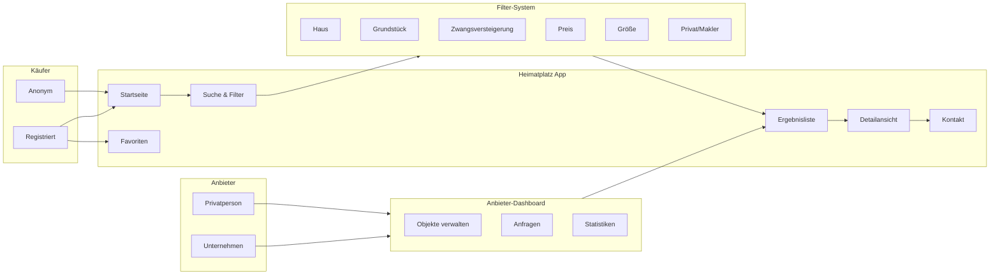

# FigJam - Konzept & User Flows

## FigJam URL

https://www.figma.com/online-whiteboard/create-diagram/2e255d19-3f3d-4d44-9b40-6988f3ca2724

## User Flows

### Käufer (Buyers)

```
Käufer
├── Anonym (ohne Account)
│   ├── Suchen & Filtern
│   ├── Ergebnisse ansehen
│   └── Details ansehen
│
└── Registriert (mit Account)
    ├── Alle anonymen Features
    ├── Favoriten speichern
    ├── Suchprofile anlegen
    └── Kontakt zu Anbietern
```

### Anbieter (Sellers)

```
Anbieter
├── Privatperson
│   ├── Einfache Registrierung
│   ├── Eigene Objekte inserieren
│   └── Anfragen verwalten
│
└── Unternehmen (Makler)
    ├── Firmen-Account
    ├── Mehrere Objekte verwalten
    ├── Team-Mitglieder
    └── Statistiken & Analytics
```

## Filter-System

### Basis-Filter (immer sichtbar)
- Immobilienart: Haus, Grundstück, Zwangsversteigerung
- Preis: Min/Max Slider
- Größe: m² Bereich
- Zimmer: Anzahl

### Erweiterte Filter
- Standort: Bezirk, Gemeinde
- Anbietertyp: Privat / Makler
- Baujahr
- Ausstattung

## Mermaid Diagramm (Original)


